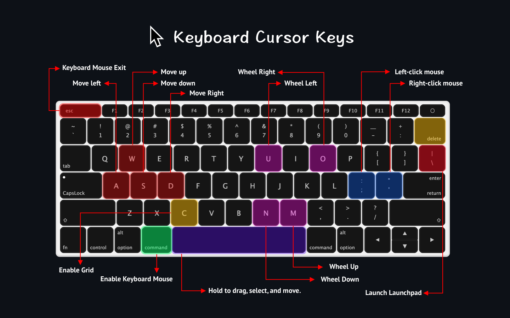

<!--idoc:ignore:start-->
> [!TIP]
> Declaration: This project is not an open-source project. The repository serves as the official website, used to collect issues and user demands. This is done to save costs, because without an official website, the application cannot pass the review.
<!--idoc:ignore:end-->

   
   
  
  <h1>
    Mousio
  </h1>
  <!--rehype:style=border: 0;-->
  

    <a href="./README.zh.md">简体中文</a> • 
    <a target="_blank" href="https://github.com/jaywcjlove/mousio/issues/new?template=bug_report.yml">Contact & Support</a> • 
    <a href="./CHANGELOG.md">Changelog</a>
  

  

    
  

Enjoy a keyboard-only experience without the need for a mouse or trackpad. Quickly move, click, and drag the mouse cursor using only your keyboard. Inspired by Vim’s keyboard-first philosophy, it brings common mouse operations to the keyboard, reducing the need to switch between the keyboard and mouse and helping you work more efficiently while staying focused.

At the same time, it is an accessibility tool designed specifically for keyboard-based interaction. It is ideal for users who want to reduce their reliance on a mouse and improve keyboard efficiency, as well as users with limited mobility, motor impairments, hand tremors, arthritis, repetitive strain injuries (RSI), or other conditions that make using a mouse or trackpad difficult, uncomfortable, or painful—making computer interaction simpler and more flexible.

### Features

- **Hotkey Launchpad**: Open apps in Launchpad using shortcuts
- **Keyboard-driven cursor control**: Instantly move and position the mouse pointer using keyboard shortcuts  
- **Grid navigation mode**: Navigate precisely using a resizable on-screen grid  
- **Multi-display support**: Seamlessly move the cursor across multiple monitors  
- **Custom Dock-style launcher**: Create a customizable Dock-style panel for quick app or action access  
- **Focus Screen**: Highlight the screen under the mouse cursor to focus on the active area.  
- **Hint settings support**: Use shortcuts to quickly locate UI elements and move the pointer.
- **Statistics**: Track usage statistics and key press counts

### [Mousio Hint](https://github.com/jaywcjlove/mousio-hint)

[Mousio Hint](https://github.com/jaywcjlove/mousio-hint) is an auxiliary enhancement tool that works in conjunction with the main **Mousio** app. Its purpose is to **significantly boost your system operating efficiency through keyboard control**.

[Mousio Hint](https://github.com/jaywcjlove/mousio-hint)'s core function is to generate **keyboard shortcut hints** next to on-screen UI elements. These hints allow you to quickly move your mouse pointer to the target location using only your keyboard, completely eliminating the need for manual mouse operation.

### Shortcuts

- Enable Keyboard Mouse: Double tap <kbd>Ctrl ⌃</kbd> / <kbd>Cmd ⌘</kbd> / <kbd>Opt ⌥</kbd>
- Exit Keyboard Mouse Mode: <kbd>ESC</kbd>
- Arrow Key Layout:
  - <kbd>W ↑</kbd> <kbd>A ←</kbd> <kbd>S ↓</kbd> <kbd>D →</kbd>
  - <kbd>H ←</kbd> <kbd>J ↓</kbd> <kbd>K ↑</kbd> <kbd>L →</kbd>
  - <kbd>E ←</kbd> <kbd>S ↓</kbd> <kbd>D ↑</kbd> <kbd>F →</kbd>
  - <kbd>▼ ↓</kbd> <kbd>▲ ↑</kbd> <kbd>▶ →</kbd> <kbd>◀ ←</kbd>
- Enable Grid Navigation Mode: <kbd>C</kbd>
- Enable Launchpad: Backslash <kbd>\</kbd>; Search shortcut: <kbd>Cmd ⌘+/</kbd>
- Reset Search in Grid Navigation Mode: <kbd>Delete ⌫</kbd>
- Hold <kbd>Space ␣</kbd> and use <kbd>A</kbd> <kbd>S</kbd> <kbd>W</kbd> <kbd>D</kbd> to move windows, select text, and move files
- Left Mouse Click: <kbd>;:</kbd> or <kbd>↩︎ retern</kbd>
- Right Mouse Click: <kbd>'"</kbd>
- Mouse Wheel Scroll:
  - ⬅️ Scroll Left: <kbd>U</kbd>
  - ➡️ Scroll Right: <kbd>O</kbd>
  - ⬇️ Scroll Down: <kbd>N</kbd>
  - ⬆️ Scroll Up: <kbd>M</kbd>