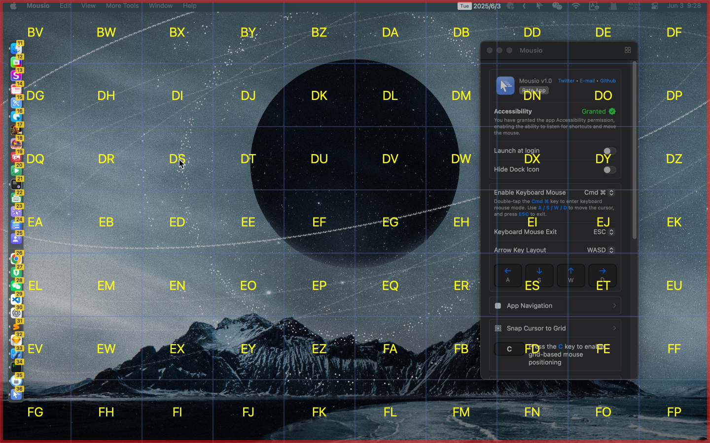
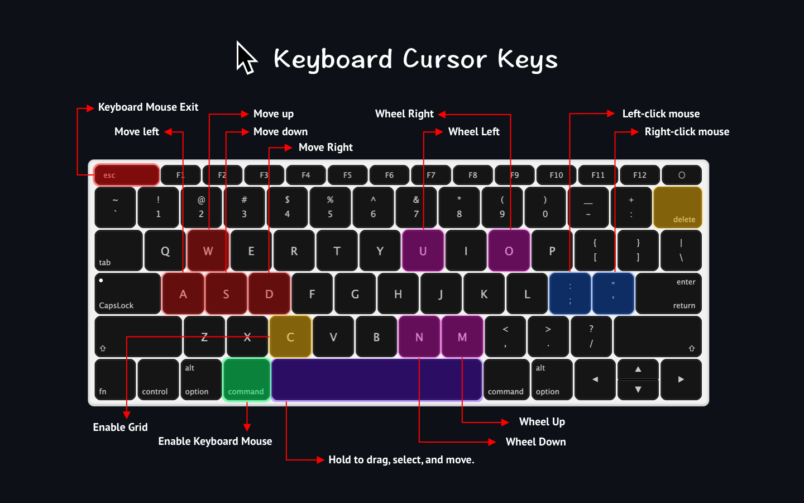

<!--idoc:ignore:start-->
> [!TIP]
> Declaration: This project is not an open-source project. The repository serves as the official website, used to collect issues and user demands. This is done to save costs, because without an official website, the application cannot pass the review.
<!--idoc:ignore:end-->

   
   
  
  <h1>
    Mousio
  </h1>
  <!--rehype:style=border: 0;-->
  

    <a href="./README.zh.md">简体中文</a> • 
    <a target="_blank" href="https://github.com/jaywcjlove/mousio/issues/new?template=bug_report.yml">Contact & Support</a> • 
    <a href="./CHANGELOG.md">Changelog</a>
  

  

    
  

No need to touch the mouse — everything at your fingertips!

Quickly move, click, and drag the mouse cursor using just your keyboard. Boost your efficiency and stay focused.

### Features

- **Keyboard-driven cursor control**: Instantly move and position the mouse pointer using keyboard shortcuts  
- **Grid navigation mode**: Navigate precisely using a resizable on-screen grid  
- **Multi-display support**: Seamlessly move the cursor across multiple monitors  
- **Custom Dock-style launcher**: Create a customizable Dock-style panel for quick app or action access  
- **Focus Screen**: Highlight the screen under the mouse cursor to focus on the active area.  

### Shortcuts

- Enable Keyboard Mouse: Double tap <kbd>Ctrl ⌃</kbd> / <kbd>Cmd ⌘</kbd> / <kbd>Opt ⌥</kbd>
- Exit Keyboard Mouse Mode: <kbd>ESC</kbd>
- Arrow Key Layout:
  - <kbd>W ↑</kbd> <kbd>A ←</kbd> <kbd>S ↓</kbd> <kbd>D →</kbd>
  - <kbd>H ←</kbd> <kbd>J ↓</kbd> <kbd>K ↑</kbd> <kbd>L →</kbd>
  - <kbd>J ↓</kbd> <kbd>K ↑</kbd> <kbd>I →</kbd> <kbd>L →</kbd>
- Enable Grid Navigation Mode: <kbd>C</kbd>
- Reset Search in Grid Navigation Mode: <kbd>Delete ⌫</kbd>
- Hold <kbd>Space ␣</kbd> and use <kbd>A</kbd> <kbd>S</kbd> <kbd>W</kbd> <kbd>D</kbd> to move windows, select text, and move files
- Left Mouse Click: <kbd>;</kbd> or <kbd>:</kbd>
- Right Mouse Click: <kbd>'</kbd> or <kbd>"</kbd>
- Mouse Wheel Scroll:
  - ⬅️ Scroll Left: <kbd>U</kbd>
  - ➡️ Scroll Right: <kbd>O</kbd>
  - ⬇️ Scroll Down: <kbd>N</kbd>
  - ⬆️ Scroll Up: <kbd>M</kbd>