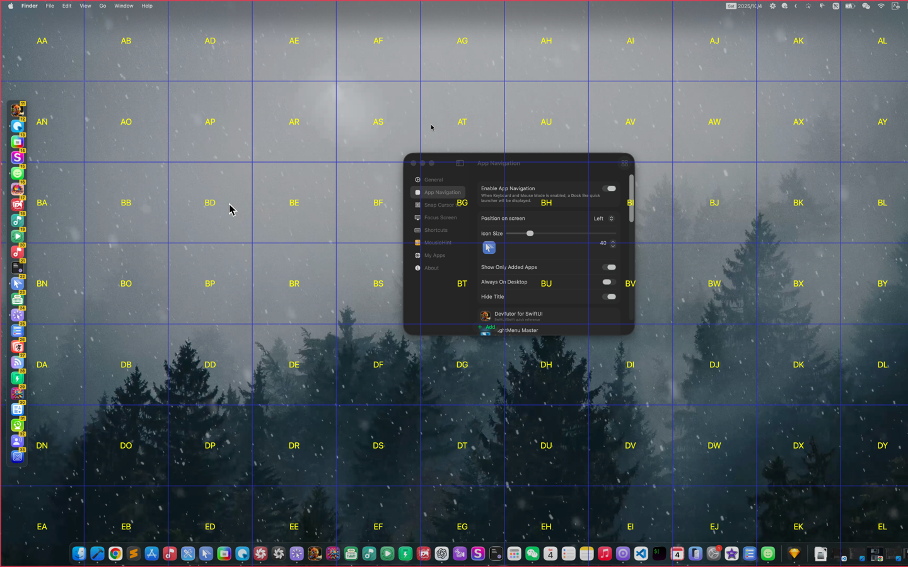
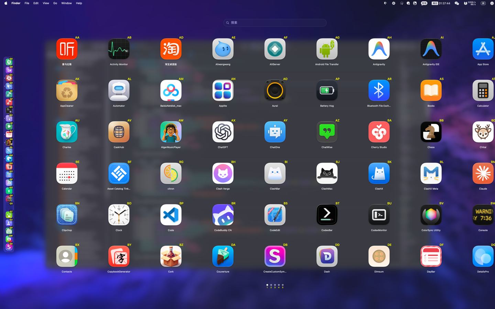
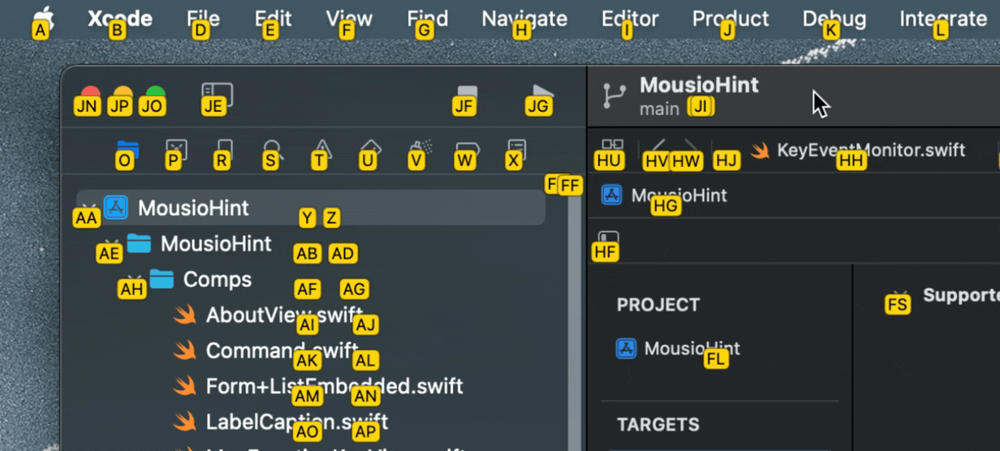
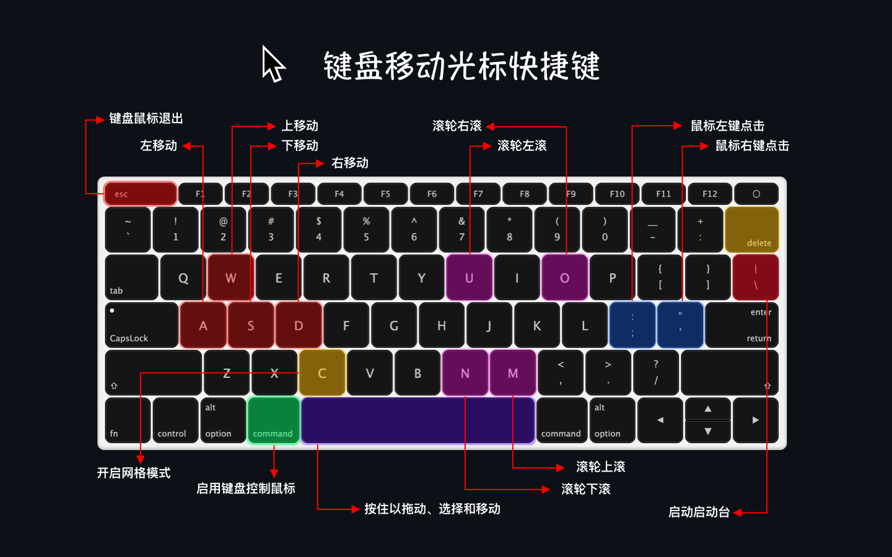

<!--idoc:ignore:start-->
> [!TIP]
> 声明：此项目并非开源项目，仓库作为官方网站，用于收集问题和用户需求。这样做是为了节省成本，因为没有官网，应用无法通过审核。
<!--idoc:ignore:end-->

   
   
  
  <h1>
    Mousio
  </h1>
  <!--rehype:style=border: 0;-->
  

    <a href="./README.md">English</a> • 
    <a target="_blank" href="https://github.com/jaywcjlove/mousio/issues/new?template=bug_report_cn.yml">联系&支持</a> • 
    <a href="./CHANGELOG.zh.md">更新日志</a>
  

  

    
  

纯键盘操作体验，无需鼠标或触控板，仅使用键盘即可快速移动、点击和拖动鼠标光标。灵感来自 Vim 的键盘优先理念，让常用的鼠标操作也能通过键盘完成，减少在键盘与鼠标之间频繁切换，提升操作效率，保持专注。

同时，这也是一款专为键盘操作设计的无障碍辅助工具，既适合希望减少鼠标依赖、提升键盘操作效率的用户，也适合运动功能受限、行动不便、肢体震颤、关节炎、重复性劳损（RSI）以及其他使用鼠标或触控板感到困难、不适或疼痛的用户，让电脑操作更加简单、灵活。

### 功能特点

- **快捷键启动台**：使用快捷键在启动台中启用应用
- **键盘驱动光标控制**：使用快捷键即时移动和定位鼠标指针  
- **网格导航模式**：通过可调整大小的屏幕网格实现精准导航  
- **多显示器支持**：无缝在多个显示器之间移动光标  
- **自定义 Dock 样式启动器**：创建可自定义的 Dock 样式面板，快速访问应用或操作  
- **焦点屏幕**：高亮鼠标光标所在屏幕，聚焦当前操作区域
- **支持 Hint 设置**：通过快捷键快速定位界面元素并移动鼠标指针
- **统计**：统计功能和按键使用次数

### [Mousio Hint](https://github.com/jaywcjlove/mousio-hint)

[Mousio Hint](https://github.com/jaywcjlove/mousio-hint) 是一款辅助增强工具，它与主应用 Mousio 协同工作，旨在**通过键盘大幅提升您的系统操作效率**。

[Mousio Hint](https://github.com/jaywcjlove/mousio-hint) 的核心功能是在屏幕上的界面元素旁生成**快捷键提示**。通过这些提示，您可以用键盘快速将鼠标指针移动到目标位置，完全无需手动操作鼠标。

### 快捷键

- 启用键盘鼠标模式：<kbd>Ctrl ⌃</kbd> / <kbd>Cmd ⌘</kbd> / <kbd>Opt ⌥</kbd> 双击
- 退出键盘鼠标模式：<kbd>ESC</kbd>
- 方向键布局：
  - <kbd>W ↑</kbd> <kbd>A ←</kbd> <kbd>S ↓</kbd> <kbd>D →</kbd>
  - <kbd>H ←</kbd> <kbd>J ↓</kbd> <kbd>K ↑</kbd> <kbd>L →</kbd>
  - <kbd>E ←</kbd> <kbd>S ↓</kbd> <kbd>D ↑</kbd> <kbd>F →</kbd>
  - <kbd>▼ ↓</kbd> <kbd>▲ ↑</kbd> <kbd>▶ →</kbd> <kbd>◀ ←</kbd>
- 启用网格导航模式：<kbd>C</kbd>
- 启用启动台：<kbd>\</kbd>，搜索快捷键<kbd>Cmd ⌘+/</kbd>
- 网格导航模式重置搜索：<kbd>删除 ⌫</kbd>
- 按住 <kbd>空格 ␣</kbd>，配合 <kbd>A</kbd> <kbd>S</kbd> <kbd>W</kbd> <kbd>D</kbd> 移动窗口、选中文本和移动文件
- 鼠标左键点击：<kbd>;:</kbd> 或 <kbd>↩︎ 回车</kbd>
- 鼠标右键点击：<kbd>'"</kbd>
- 鼠标滚轮滚动：
  - ⬅️ 左滚动：<kbd>U</kbd>
  - ➡️ 右滚动：<kbd>O</kbd>
  - ⬇️ 下滚动：<kbd>N</kbd>
  - ⬆️ 上滚动：<kbd>M</kbd>
