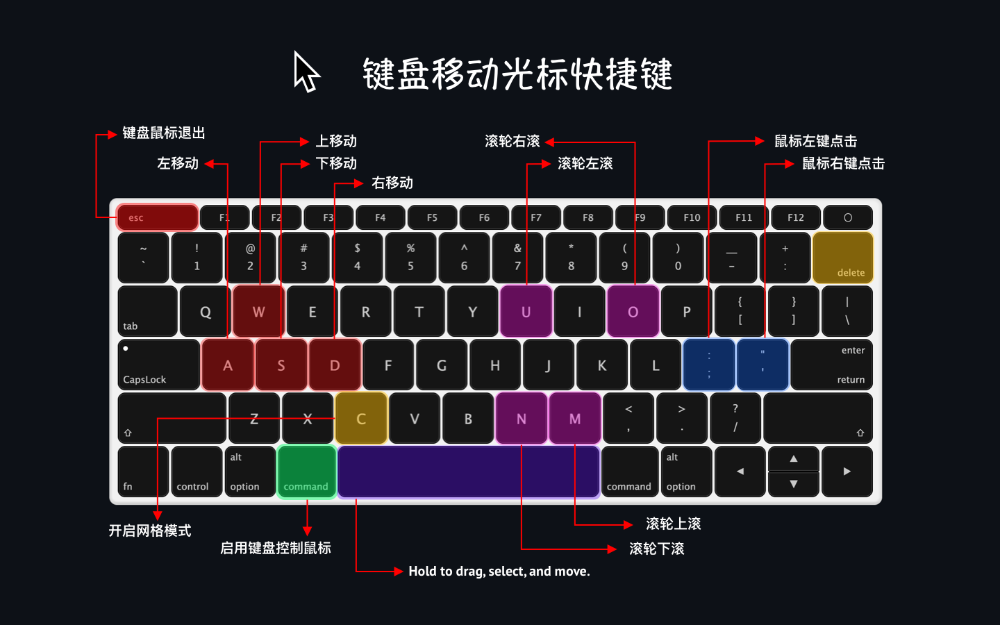

<!--idoc:ignore:start-->
> [!TIP]
> 声明：此项目并非开源项目，仓库作为官方网站，用于收集问题和用户需求。这样做是为了节省成本，因为没有官网，应用无法通过审核。
<!--idoc:ignore:end-->

   
   
  
  <h1>
    Mousio
  </h1>
  <!--rehype:style=border: 0;-->
  

    <a href="./README.md">English</a> • 
    <a target="_blank" href="https://github.com/jaywcjlove/mousio/issues/new?template=bug_report_cn.yml">联系&支持</a> • 
    <a href="./CHANGELOG.zh.md">更新日志</a>
  

  

    
  

无需动鼠标，一切尽在指尖！

使用键盘即可快速移动、点击和拖动鼠标光标。提升效率，保持专注。

### 功能特点

- **键盘驱动光标控制**：使用快捷键即时移动和定位鼠标指针  
- **网格导航模式**：通过可调整大小的屏幕网格实现精准导航  
- **多显示器支持**：无缝在多个显示器之间移动光标  
- **自定义 Dock 样式启动器**：创建可自定义的 Dock 样式面板，快速访问应用或操作  

### 快捷键

- 启用键盘鼠标模式：<kbd>Ctrl ⌃</kbd> / <kbd>Cmd ⌘</kbd> / <kbd>Opt ⌥</kbd> 双击
- 退出键盘鼠标模式：<kbd>ESC</kbd>
- 方向键布局：
  - <kbd>W ↑</kbd> <kbd>A ←</kbd> <kbd>S ↓</kbd> <kbd>D →</kbd>
  - <kbd>H ←</kbd> <kbd>J ↓</kbd> <kbd>K ↑</kbd> <kbd>L →</kbd>
  - <kbd>J ↓</kbd> <kbd>K ↑</kbd> <kbd>I →</kbd> <kbd>L →</kbd>
- 启用网格导航模式：<kbd>C</kbd>
- 网格导航模式重置搜索：<kbd>删除 ⌫</kbd>
- 按住 <kbd>空格 ␣</kbd>，配合 <kbd>A</kbd> <kbd>S</kbd> <kbd>W</kbd> <kbd>D</kbd> 移动窗口、选中文本和移动文件
- 鼠标左键点击：<kbd>;</kbd> 或 <kbd>:</kbd>
- 鼠标右键点击：<kbd>'</kbd> 或 <kbd>"</kbd>
- 鼠标滚轮滚动：
  - ⬅️ 左滚动：<kbd>U</kbd>
  - ➡️ 右滚动：<kbd>O</kbd>
  - ⬇️ 下滚动：<kbd>N</kbd>
  - ⬆️ 上滚动：<kbd>M</kbd>